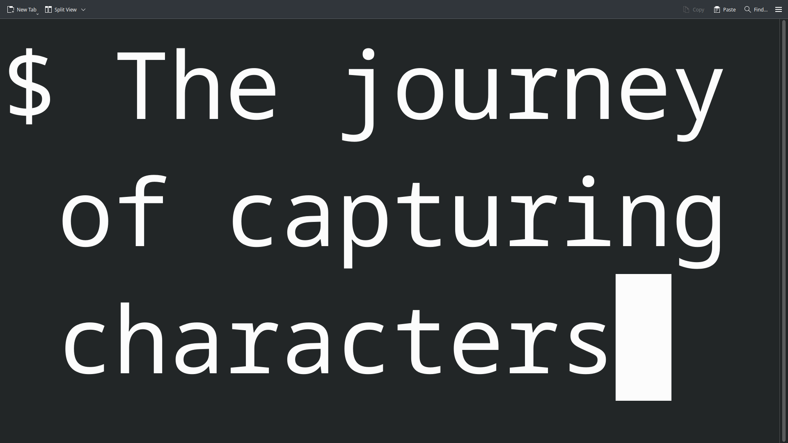

# tek-c
A text editor in C

## Prerequisites
This project was compiled under the following conditions:
- GCC 15 (-std=gnu23) [Also works with -std=c99]

## Controls
Handling operations at current state.
These are helpful while canonical mode is enabled
- `Ctrl+D` - Send EOT signal (Closes program) [Current Status: **Disabled**]
- `reset` (then press `Enter`) - In case terminal output is still not present after exiting the program [Current Status: **Disabled**]
- `Ctrl+Z` - Suspends program to background | `fg` - brings back to foreground. (MacOS can be problematic with resuming a background job after keying in `fg`. Might be due to `read` function receiving **-1**) [Current Status: **Disabled**]
- `Ctrl+S` - Suspends program flow control(XOFF). Resumed by `Ctrl+Q`(XON) [Current Status: **Disabled**]
- `Ctrl+M` - Carriage return is read as its proper ASCII value. Disables automatic new lines from carriage returns [Current Status: **Disabled**]

## Ignored Flags
- Input: **BRKINT** | **INPCK** | **ISTRIP**
- Output: **CS8**
- Local: **IEXTEN**

## Add-ons (Upcoming)
- Search : `Ctrl+F`